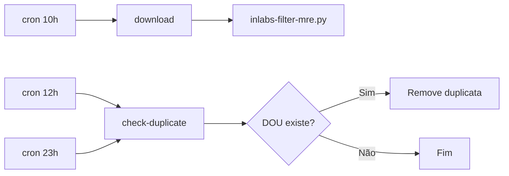
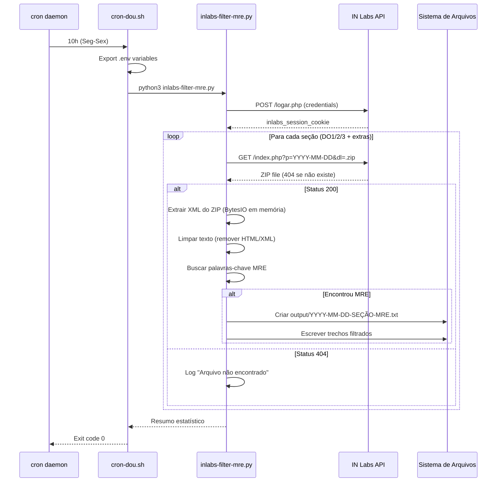
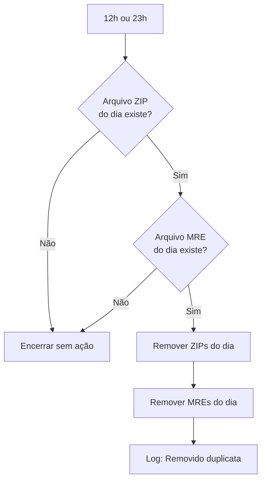

# Arquitetura do Sistema DOU Download + Filtragem MRE

## 1. Visão Geral de Alto Nível

O sistema é uma solução automatizada para download e filtragem do Diário Oficial da União (DOU) com foco em conteúdo do Ministério das Relações Exteriores (MRE). A arquitetura segue um modelo de processamento em lote agendado com três componentes principais:

```
┌─────────────────────────────────────────────────────────────┐
│                    CAMADA DE AGENDAMENTO                    │
│                      (cron + shell)                         │
└────────────────────────┬────────────────────────────────────┘
                         │
                         ▼
┌─────────────────────────────────────────────────────────────┐
│                 CAMADA DE PROCESSAMENTO                     │
│                   (Python + requests)                       │
│  ┌──────────────┐  ┌──────────────┐  ┌──────────────┐    │
│  │ Autenticação │  │   Download   │  │  Filtragem   │    │
│  │   IN Labs    │  │   XML/ZIP    │  │     MRE      │    │
│  └──────────────┘  └──────────────┘  └──────────────┘    │
└────────────────────────┬────────────────────────────────────┘
                         │
                         ▼
┌─────────────────────────────────────────────────────────────┐
│                  CAMADA DE ARMAZENAMENTO                    │
│              (output/ + arquivos temporários)               │
└─────────────────────────────────────────────────────────────┘
```

### Propósito do Sistema

1. **Monitoramento Automatizado**: Baixar automaticamente o DOU em horários estratégicos
2. **Detecção de Relevantes**: Filtrar conteúdo relacionado ao MRE
3. **Gestão de Duplicatas**: Evitar armazenamento redundante de edições idênticas
4. **Rastreamento**: Manter histórico de publicações relevantes

## 2. Interações de Componentes

### 2.1. Camada de Agendamento (cron-dou.sh)

**Responsabilidade**: Orquestrar execução automática



**Fluxo de Execução**:

1. **10h (Seg-Sex)**: Download inicial
   - Executa `inlabs-filter-mre.py`
   - Baixa todas as seções DO1, DO2, DO3 + extras
   - Filtra por palavras-chave MRE
   - Salva resultados em `output/YYYY-MM-DD-SEÇÃO-MRE.txt`

2. **12h e 23h (Seg-Sex)**: Verificação de duplicatas
   - Verifica se arquivos DOU do dia já existem
   - Se existirem, remove (assumindo DOU já publicado anteriormente)
   - Se não existirem, encerra sem ação

**Variáveis de Ambiente**:
- `INLABS_EMAIL`: Credencial de acesso ao IN Labs
- `INLABS_PASSWORD`: Senha de acesso ao IN Labs

### 2.2. Camada de Processamento (Python)

**Componentes Principais**:

#### A. Autenticação IN Labs
```python
def download_xml_filtrado():
    # 1. POST para login URL
    response = s.request("POST", url_login, data=payload, headers=headers)

    # 2. Verifica cookie de sessão
    cookie = s.cookies.get('inlabs_session_cookie')
```

**Fluxo de Autenticação**:
1. Envia credenciais via POST para `https://inlabs.in.gov.br/logar.php`
2. Recebe cookie `inlabs_session_cookie`
3. Usa cookie em requisições subsequentes para download

#### B. Download de XMLs
```python
url_arquivo = f"{url_download}{data_completa}&dl={data_completa}-{dou_secao}.zip"
response_arquivo = s.request("GET", url_arquivo, headers=cabecalho_arquivo)
```

**Estratégia de Download**:
- Tenta todas as seções: DO1, DO2, DO3, DO1E, DO2E, DO3E
- Tolerância a falhas: 404 (não existe) é tratado como normal
- Outros status codes são logados como erro

#### C. Extração e Parse de XML
```python
def extrair_texto_xml(conteudo_zip):
    with zipfile.ZipFile(BytesIO(conteudo_zip)) as zip_ref:
        for arquivo in zip_ref.namelist():
            if arquivo.endswith('.xml'):
                xml_content = zip_ref.read(arquivo)
                return xml_content.decode('utf-8', errors='ignore')
```

**Tratamento de ZIP**:
- ZIPs podem conter imagens (.jpg) + XMLs
- Apenas o primeiro arquivo .xml é processado
- Erros de decode são ignorados (`errors='ignore'`)

#### D. Limpeza e Padronização de Texto
```python
def limpar_texto_xml(texto):
    # Remove tags HTML
    texto = re.sub(r'</?p>', '', texto)
    texto = re.sub(r'<br\s*/?>', '\n', texto)
    texto = re.sub(r'</?[a-z]+[^>]*>', '', texto)

    # Remove atributos XML
    texto = re.sub(r'\s*[a-zA-Z]+="[^"]*"', '', texto)
    texto = re.sub(r'&[a-z]+;', ' ', texto)

    # Normaliza espaços
    texto = re.sub(r'\s+', ' ', texto)
    return texto.strip()
```

**Padronização Aplicada**:
1. Remoção de tags HTML (`<p>`, `</p>`, `<br>`, etc.)
2. Remoção de atributos XML (`artType="Portaria"`, `pubDate="02/03/2026"`)
3. Normalização de espaços e quebras de linha
4. Remoção de entidades HTML (`&nbsp;`, `&amp;`, etc.) via `re.sub()`

#### E. Filtragem por Palavras-Chave
```python
PALAVRAS_CHAVE = [
    "ministério das relações exteriores",
    "ministério relações exteriores",
    "oficial de chancelaria",
    "chancelaria",
    "concursos públicos",
    "concursos",
    "mre",
    "embaixada",
    "consulado",
    "diplomacia"
]
```

**Algoritmo de Filtragem**:
1. `filtrar_conteudo()`: Busca case-insensitive de cada palavra-chave
2. `filtrar_conteudo()`: Extrai 200 caracteres antes + 500 depois da ocorrência
3. `limpar_texto_xml()`: Aplica limpeza de texto no contexto extraído
4. `filtrar_conteudo()`: Limita contexto a 300 caracteres

### 2.3. Camada de Armazenamento

**Estrutura de Diretórios**:

```
dou-script/
├── output/                    # Resultados filtrados (MRE)
│   ├── 2026-03-02-DO1-MRE.txt
│   ├── 2026-03-02-DO2-MRE.txt
│   └── 2026-03-02-DO3-MRE.txt
├── public/python/             # Scripts de processamento
│   ├── inlabs-filter-mre.py   # Script principal (cron)
│   └── inlabs-auto-download-*.py
├── cron-dou.sh                # Wrapper para agendamento
└── .env                       # Credenciais (não versionado)
```

**Formato de Arquivo de Saída**:

```
=== TRECHOS MRE ENCONTRADOS - 2026-03-02 - DO2 ===

[1] PALAVRA-CHAVE: MINISTÉRIO DAS RELAÇÕES EXTERIORES
CONTEXTO:
proventos integrais a [NOME REDATIDO], matrícula SIAPE nº [SIAPE REDATIDO],
matrícula SIAPECAD nº [SIAPECAD REDATIDO], ocupante do cargo de assistente de chancelaria,
classe S, padrão V, do Quadro de Pessoal do Ministério das Relações Exteriores...
--------------------------------------------------------------------------------
```

## 3. Diagramas de Fluxo de Dados

### 3.1. Fluxo Completo (Download → Filtragem → Armazenamento)



### 3.2. Fluxo de Detecção de Duplicata



### 3.3. Fluxo de Limpeza de Texto


## 4. Decisões de Design e Justificativa

### 4.1. Linguagem e Frameworks

**Decisão**: Python 3 com biblioteca `requests`

**Justificativa**:
- ✅ Python tem excelente suporte a processamento de texto e XML
- ✅ Biblioteca padrão `zipfile` facilita extração de ZIPs na memória
- ✅ `requests` é o padrão de facto para HTTP em Python
- ✅ Fácil integração com cron (scripts standalone)
- ✅ Manipulação simples de strings com regex (`re` module)

**Métricas Reais**:
- ZIP size médio: ~1-5MB
- Processing time: ~30-60 segundos por ZIP
- Memory usage: ~10-50MB

### 4.2. Autenticação via Cookie

**Decisão**: Manual extraction de cookie `inlabs_session_cookie`

**Justificativa**:
- ✅ IN Labs não usa OAuth ou tokens JWT
- ✅ Cookie é persistente durante a sessão
- ✅ Evita implementação de web scraping complexo
- ⚠️ Limitação: Cookie pode expirar (requer re-login)

### 4.3. Processamento em Memória

**Decisão**: Usar `BytesIO` para processar ZIPs sem escrever em disco

**Justificativa**:
- ✅ Reduz I/O de disco
- ✅ ZIPs são temporários (apenas para extração de XML)
- ✅ Menos risco de arquivos órfãos
- ⚠️ Limitação: ZIPs grandes podem consumir muita RAM

**Alternativa Considerada**: Extrair ZIP para disco antes de processar
- ❌ Rejeitada: Mais complexo, maior risco de files órfãos

### 4.4. Extração de Texto vs Parse XML Estruturado

**Decisão**: Extração de texto com regex ao invés de parse DOM

**Justificativa**:
- ✅ XMLs do DOU têm estrutura inconsistente
- ✅ Contexto ao redor da palavra-chave é mais importante que estrutura
- ✅ Regex é mais flexível para variações de formato
- ⚠️ Limitação: Perde metadados estruturados (hierarquia, namespaces)

**Alternativa Considerada**: Parse com `ElementTree` ou `lxml`
- ❌ Rejeitada: XMLs DOU têm namespaces complexos e estrutura variável

### 4.5. Diretório `output/` Separado

**Decisão**: Salvar resultados em `output/` ao invés de diretório raiz

**Justificativa**:
- ✅ Separação clara entre código e dados
- ✅ Fácil de adicionar ao `.gitignore`
- ✅ Facilita backup e limpeza
- ✅ Prepara para futura migração para banco de dados

### 4.6. Estratégia de Duplicata (12h/23h)

**Decisão**: Verificar e remover duplicatas em horários fixos

**Justificativa**:
- ✅ DO pode ser republicado no mesmo dia (correções)
- ✅ Evita armazenar múltiplas cópias idênticas
- ✅ 23h garante limpeza final do dia
- ⚠️ Limitação: Assume que DO1 vespertino é correção, não edição extra

### 4.7. Tratamento de Erros "Silencioso"

**Decisão**: Logar erros mas não falhar completamente

**Justificativa**:
- ✅ 404 é normal (edições extras nem sempre existem)
- ✅ Uma seção falhar não deve impedir as demais
- ✅ Erros de decode são ignorados (`errors='ignore'`)
- ⚠️ Limitação: Pode esconder problemas sistêmicos

## 5. Restrições e Limitações do Sistema

### 5.1. Restrições de Funcionalidade

| Restrição | Impacto | Mitigação |
|-----------|---------|-----------|
| **Sem verificação de integridade** | Arquivos corrompidos podem ser processados | Considerar checksum MD5/SHA256 |
| **Sem retry automático** | Falhas de rede causam loss permanente | Implementar exponential backoff |
| **Sem banco de dados** | Busca histórica é lenta (grep em arquivos) | Migrar para SQLite/PostgreSQL |
| **Sem autenticação multifator** | Credenciais expostas em .env | Usar credenciais rotativas |
| **Sem monitoramento** | Falhas passam despercebidas | Integrar com Sentry/Papertrail |
| **Sem rate limiting** | Muitas requisições podem bloquear IP | Implementar delays entre requests |

### 5.2. Limitações de Escala

| Limitação | Capacidade Atual | Cenário de Falha |
|-----------|------------------|------------------|
| **Armazenamento local** | Ilimitado (disco local) | Disco cheio → falha de escrita |
| **Processamento single-thread** | ~6 ZIPs por execução | 100+ seções DOU seriam lentas |
| **Busca linear em texto** | O(n) por palavra-chave | XMLs gigantes (>100MB) seriam lentos |
| **Sem cache** | Re-busca a cada execução | Multiplas execuções no mesmo dia |

### 5.3. Dependências Externas

| Serviço | Falha Possível | Impacto | Plano de Contingência |
|---------|----------------|---------|----------------------|
| **IN Labs API** | Manutenção, DDoS | Sem downloads | Verificar status page, implementar fila de retry |
| ** Sistema de arquivos** | Permissões, disco cheio | Sem escrita | Monitorar espaço em disco, alertar < 10% |
| **cron daemon** | Serviço parado | Sem execução | Monitorar processos, implementar health check |

### 5.4. Limitações de Filtragem

**Falso Positivos**:
- Palavras-chave em contextos irrelevantes (ex: "diplomacia" em artigo acadêmico)
- Siglas "MRE" em outros ministérios

**Falso Negativos**:
- Abreviações não previstas (ex: "M.R.E." com pontos)
- Erros ortográficos no DOU original
- Contexto em imagens (PDFs escaneados)

**Mitigações Futuras**:
- NLP/classificação de texto em vez de busca por palavra-chave
- OCR para imagens
- Lista de exclusão de falso positivos

### 5.5. Limitações de Segurança

| Risco | Severidade | Mitigação Atual | Mitigação Recomendada |
|-------|------------|-----------------|----------------------|
| **Credenciais em texto plano** | Alta | .env no .gitignore | Hash de senha, keyring integration |
| **Sem TLS verification** | Média | requests usa verify=True por padrão | ✅ Já mitigado |
| **Sem rate limiting** | Média | N/A | Implementar delay entre requests |
| **Sem audit log** | Baixa | N/A | Log todas as operações em arquivo rotativo |

### 5.6. Limitações de Manutenibilidade

**Complexidade Técnica**:
- Scripts Python estão em `public/python/` (não padrão)
- Sem módulos `__init__.py`, tudo é script flat
- Sem testes automatizados

**Dívida Técnica**:
- Código de limpeza de texto está duplicado em 2 scripts
- Sem type hints
- Sem documentação inline (docstrings básicas)

**Recomendações Futuras**:
1. Refatorar para package Python estruturado
2. Adicionar testes unitários com `pytest`
3. Implementar CI/CD (GitHub Actions)
4. Adicionar type hints com `mypy`

## 6. Evolução Futura Sugerida

### 6.1. Curto Prazo (1-3 meses)

- [ ] Adicionar testes E2E para fluxo principal
- [ ] Implementar monitoramento (Sentry/Papertrail)
- [ ] Adicionar flag `--dry-run` para testes sem download
- [ ] Migrar para estrutura de package Python

### 6.2. Médio Prazo (3-6 meses)

- [ ] Implementar banco de dados SQLite para histórico
- [ ] Adicionar API REST para consulta de resultados
- [ ] Implementar NLP para classificação mais precisa
- [ ] Adicionar dashboard web (Django/FastAPI)

### 6.3. Longo Prazo (6-12 meses)

- [ ] Migrar para arquitetura de microsserviços
- [ ] Implementar processamento distribuído (Celery/Redis)
- [ ] Adicionar suporte a múltiplos órgãos (além de MRE)
- [ ] Implementar alertas em tempo real (WebSocket/Webhook)

---

**Documento de Arquitetura v1.0**
**Data**: 2026-03-04
**Autor**: Sistema DOU Download + Filtragem MRE
**Status**: Production
